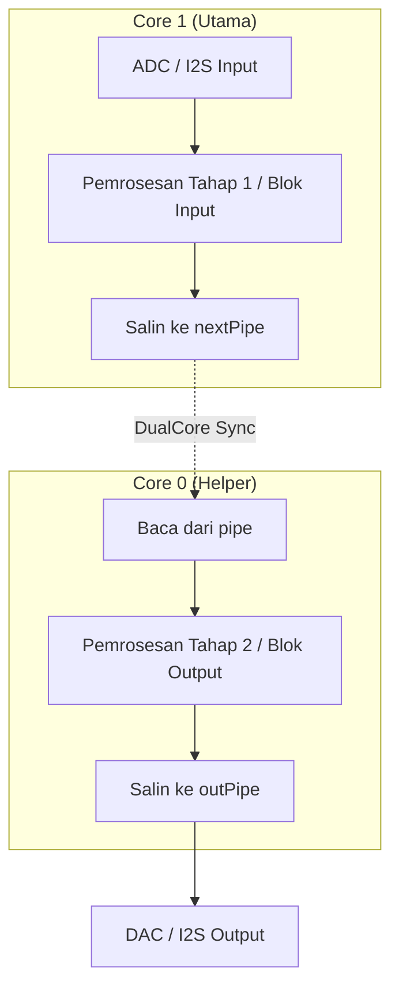

# RAD_DSP_LIB

**RAD_DSP_LIB** adalah library pemrosesan sinyal digital (DSP) audio stereo real-time berkinerja tinggi yang dirancang khusus untuk mikrokontroler **ESP32** menggunakan Arduino Core 3.0+ (ESP-IDF 5.x).

Pustaka ini dirancang untuk memproses audio multi-channel dengan latensi ultra-rendah melalui arsitektur dual-core paralel, serta dilengkapi dengan antarmuka Bluetooth A2DP Sink yang disinkronkan secara asinkron.

---

## Fitur Utama

1. **ASRC Kubik Hermite (Hi-Fi Resampler):**
   * Mengonversi audio Bluetooth (44.1 kHz) ke laju jam DAC sistem (**48.0 kHz**) secara asinkron (ASRC).
   * Menggunakan interpolasi kubik Hermite 4-titik (*Horner's Method*) untuk menjaga frekuensi tinggi tetap jernih ($< -0.5\text{ dB}$ redaman pada $20\text{ kHz}$).
   * Dilengkapi algoritma *Frequency Locked Loop* (FLL) otomatis berbasis deteksi level RingBuffer FreeRTOS untuk menghilangkan efek wow, flutter, dan audio stuttering (jitter).
2. **Pipeline Audio Paralel Dual-Core:**
   * Memisahkan beban pemrosesan secara paralel menggunakan *Ping-Pong Buffer Pipeline*:
     * **Core 1:** Menghitung blok input (Biquad EQ per channel, Dynamics Compressor, Mixer).
     * **Core 0:** Menghitung blok output secara simultan (FIR convolution filter, Master Limiter, Matrix Router).
3. **Hardware I2S Master & Slave:**
   * Mendukung konfigurasi fleksibel: **I2S0** berjalan sebagai Master dengan MCLK (GPIO0), sedangkan **I2S1** berjalan sebagai Slave murni.
4. **Matriks Router Adaptif:**
   * Memungkinkan rute dinamis dari input apa pun ke output fisik mana pun dengan gain linier/dB yang independen.
5. **Real-time UART Control (RadStudio GUI):**
   * Mengintegrasikan protokol parser teks UART berbasis modul ID.
   * Terintegrasi penuh dengan GUI tuning desktop **RadStudio** untuk mengubah parameter filter, biquad, compressor, dan routing matrix secara instan dan visual.

---

## Arsitektur Pemrosesan Paralel Dual-Core (Fork-Join Pipeline)

RAD_DSP_LIB dirancang untuk memaksimalkan performa komputasi mikrokontroler dual-core **ESP32** dengan membagi beban kerja secara paralel. Aliran data audio dibagi menjadi dua tahap pemrosesan menggunakan arsitektur **Fork-Join** berbasis *Ping-Pong Buffer Pipeline*:



### 1. Core 1 (Utama / Main Processor)
Core 1 bertanggung jawab atas penanganan I/O real-time (baca input hardware), manajemen kontrol eksternal, dan kalkulasi pemrosesan tahap awal (Blok Input):
* **Alur Tugas:**
  1. Membaca blok sampel audio terbaru dari perangkat input fisik (ADC/I2S).
  2. Melakukan kalkulasi pemrosesan audio tahap awal (Task A).
  3. Menyalin hasil kalkulasi ke buffer perantara (`nextPipe`) untuk dikirim ke Core 0.

### 2. Core 0 (Co-Processor / Helper)
Core 0 dialokasikan khusus untuk menangani kalkulasi matematika intensif secara asinkron dan terpisah dari aktivitas I/O Core 1:
* **Alur Tugas:**
  1. Membaca data buffer hasil kalkulasi Core 1 pada siklus sebelumnya (`pipe`).
  2. Melakukan kalkulasi pemrosesan audio tahap akhir (Task B).
  3. Menyalin hasil kalkulasi akhir ke buffer keluaran (`outPipe`) untuk dituliskan ke DAC/I2S.

### 3. Sinkronisasi Ping-Pong Buffer
* Untuk menghindari *race condition* (di mana satu core menulis ke buffer yang sedang dibaca core lain), pustaka menggunakan metode **Ping-Pong Pipeline**.
* Pada siklus waktu $t$, Core 1 memproses sampel blok audio baru ($N$), sedangkan Core 0 secara simultan memproses hasil kalkulasi Core 1 dari blok sampel sebelumnya ($N-1$).
* Koordinasi fork-join antar core diatur menggunakan *FreeRTOS Binary Semaphore* berprioritas tinggi melalui pemanggilan kelas `dualCore.process()`. Setelah kedua core menyelesaikan tugasnya pada siklus berjalan, buffer ditukar secara atomik.

---

## Struktur Folder Proyek

```text
RAD_DSP_LIB/
├── src/                      # Kode sumber C++ Pustaka DSP
│   ├── RadDSP.h              # Header Utama
│   ├── RadI2S.cpp/.h         # Driver I2S Master/Slave
│   ├── RadBluetooth.cpp/.h   # Kontroler Bluetooth Classic & ASRC
│   ├── RadMatrix.h           # Template MatrixRouter
│   ├── RadMixer.h            # Blok Mixer2 dengan Sibling Sync
│   ├── RadBiquad.cpp/.h      # Filter Biquad IIR (LowPass, HighPass, EQ)
│   ├── RadDynamics.cpp/.h    # Compressor & Limiter
│   └── RadControl.cpp/.h     # Telemetry & Parser UART Serial
├── examples/                 # Contoh sketch mandiri untuk masing-masing blok DSP
│   ├── Biquad_Filter/        # Contoh filter biquad EQ tunggal
│   ├── Bluetooth_Audio/      # Contoh penerimaan Bluetooth audio asinkron
│   ├── Dynamics_Processor/   # Contoh kompresor dinamika audio
│   ├── FIR_Filter/           # Contoh filter konvolusi FIR
│   ├── I2S_Audio/            # Contoh passthrough audio I2S dasar
│   ├── Matrix_Routing/       # Contoh perutean matriks audio adaptif
│   └── Mixer_Stereo/         # Contoh pencampur dua input audio stereo
├── test/                     # Sketsa pengujian integrasi & diagnosa sistem
│   ├── Master_Passthrough/   # Sketsa utama pipeline dual-core & telemetry
│   └── BT_Diagnostic_Test/   # Alat diagnosa koneksi Bluetooth & NVS
├── tools/
│   ├── RadStudio.py          # Aplikasi GUI Desktop Real-time Tuning
│   ├── RadScanner.py         # Scanner Route & Injektor Schema
│   └── read_serial.py        # Logger Serial UART
└── references/               # Pustaka luring dan dokumentasi referensi SDK
```

---

## Cara Memulai Cepat (Quick Start)

### 1. Instalasi Library
Salin seluruh folder `RAD_DSP_LIB` ini ke direktori pustaka Arduino global komputer Anda:
* **Windows:** `C:\Users\<Nama_User>\Documents\Arduino\libraries\RAD_DSP_LIB`

### 2. Flashing Firmware ke ESP32
1. Buka Arduino IDE atau gunakan terminal `arduino-cli`.
2. Buka salah satu berkas di folder `examples/` atau `test/Master_Passthrough/Master_Passthrough.ino`.
3. Pilih board berbasis ESP32, misalnya **LOLIN32 Lite** (atau **ESP32 Dev Module** sesuai modul hardware ESP32 yang Anda gunakan).
4. Kompilasi dan unggah (flash) firmware ke port serial mikrokontroler Anda (misalnya `COM12`).

### 3. Mengontrol Menggunakan RadStudio GUI
1. Pastikan python telah terinstal beserta library `pyserial` dan `tkinter`.
2. Jalankan aplikasi GUI dari termi## Dokumentasi Sintaks & API Lengkap

Dokumentasi ini berisi daftar kelas, fungsi, contoh inisialisasi, cara penggunaan, serta pemetaan parameter untuk setiap modul DSP yang didukung oleh pustaka **RAD_DSP_LIB** dalam mode pemrosesan mono murni.

### 1. Daftar Kelas & Fungsi DSP Library

#### A. Kelas `RadDSP::I2S`
Digunakan untuk komunikasi audio dengan chip DAC/ADC hardware eksternal.
* **Inisialisasi (`setup()`):**
  ```cpp
  // Mulai I2S0 sebagai Master pada 48 kHz, 32-bit (WS/LRCK di GPIO25, BCK di GPIO26, MCLK di GPIO0)
  i2s0.begin(I2S_NUM_0, 48000, 32, true, 26, 25, 33, 23, 0);
  ```
* **Cara Penggunaan (`audioLoop()`):**
  ```cpp
  if (i2s0.readBlock()) { // Membaca satu blok data audio (mengisi buffer internal)
      int len = i2s0.getBufferLength();     // Dapatkan ukuran buffer (misal 128 sampel)
      float* i2sL = i2s0.getLeftBuffer();   // Dapatkan pointer data audio Kiri
      float* i2sR = i2s0.getRightBuffer();  // Dapatkan pointer data audio Kanan
      
      // ... Lakukan pemrosesan audio di sini ...
      
      i2s0.writeBlock(); // Kirim kembali buffer audio internal ke DAC fisik
  }
  ```

---

#### B. Kelas `RadDSP::Bluetooth`
Mengaktifkan penerimaan Bluetooth A2DP Sink dengan resampling asinkron Hi-Fi bawaan (Hermite Cubic ASRC).
* **Inisialisasi (`setup()`):**
  ```cpp
  bt.begin("RAD-DSP-MIXER"); // Nama perangkat Bluetooth saat ditemukan HP
  ```
* **Cara Penggunaan (`audioLoop()`):**
  ```cpp
  float btL[128], btR[128];
  // Membaca audio BT dan mengoversinya secara otomatis ke target sample rate (misal 48000 Hz)
  if (!bt.readAudio(btL, btR, len, 48000)) {
      // Jika HP belum terkoneksi atau ringbuffer kosong, isi dengan hening (mute) secara aman
      memset(btL, 0, len * sizeof(float));
      memset(btR, 0, len * sizeof(float));
  }
  ```

---

#### C. Kelas `RadDSP::Biquad`
Filter Biquad IIR Mono tunggal untuk Equalizer, Crossover (Highpass/Lowpass), Shelf, dan Notch.
* **Inisialisasi & Parameter (`setup()`):**
  ```cpp
  // Contoh inisialisasi Bell/Peaking EQ, 1000 Hz, Boost +6.0 dB, Q=1.0
  eq.setParameter(0, 4.0f);    // 0: Filter Type (1=LPF, 2=HPF, 3=BPF, 4=Peaking, 5=LowShelf, 6=HighShelf)
  eq.setParameter(1, 1000.0f); // 1: Cutoff/Center Frequency (Hz)
  eq.setParameter(2, 6.0f);    // 2: Gain (dB)
  eq.setParameter(3, 1.0f);    // 3: Q-Factor
  eq.setParameter(100, 0.0f);  // 100: Bypass (0.0f = Aktif, 1.0f = Bypass)
  ```
* **Cara Penggunaan (`audioLoop()`):**
  ```cpp
  // Metode 1: Out-of-Place (Input dan Output di buffer terpisah)
  eq.process(inputBuffer, outputBuffer, len);

  // Metode 2: In-Place (Hasil ditulis langsung menimpa buffer input)
  eq.process(audioBuffer, len);
  ```

---

#### D. Kelas `RadDSP::Dynamics`
Modul dinamika amplitudo Mono tunggal untuk Compressor, Limiter, Expander, dan Noise Gate.
* **Inisialisasi & Parameter (`setup()`):**
  ```cpp
  // Contoh inisialisasi Compressor (Threshold -20dB, Ratio 4:1, Attack 10ms, Release 100ms)
  comp.setParameter(0, 0.0f);   // 0: Type (0=Compressor, 1=Limiter, 2=Expander, 3=Noise Gate)
  comp.setParameter(1, -20.0f); // 1: Threshold (dB)
  comp.setParameter(2, 4.0f);   // 2: Ratio (diabaikan pada Limiter & Noise Gate)
  comp.setParameter(3, 10.0f);  // 3: Attack Time (ms)
  comp.setParameter(4, 0.0f);   // 4: Hold Time (ms)
  comp.setParameter(5, 100.0f); // 5: Release Time (ms)
  comp.setParameter(6, 0.0f);   // 6: Makeup Gain (dB)
  comp.setParameter(7, 0.0f);   // 7: Sidechain SC Filter Type (0=None, 1=HPF, 2=LPF, 3=BPF)
  comp.setParameter(8, 1000.0f);// 8: SC Filter Freq (Hz)
  comp.setParameter(100, 0.0f); // 100: Bypass (0.0f = Aktif, 1.0f = Bypass)
  ```
* **Cara Penggunaan (`audioLoop()`):**
  ```cpp
  // Metode 1: Standar Compressor/Limiter (in-place)
  comp.process(audioBuffer, len);

  // Metode 2: Compressor dengan input Sidechain terpisah
  comp.processSidechain(audioBuffer, sidechainSensorBuffer, len);
  ```

---

#### E. Kelas `RadDSP::Mixer<N>`
Pencampur $N$ input audio mono menjadi 1 output mono dengan gain dan mute independen.
* **Inisialisasi & Parameter (`setup()`):**
  ```cpp
  RadDSP::Mixer<2> mixer; // Mixer 2 input mono
  mixer.setParameter(0, 0.0f);   // 0 s.d N-1: Gain Input 1 (dB)
  mixer.setParameter(1, -6.0f);  // Gain Input 2 (dB)
  mixer.setParameter(100, 0.0f); // 100 s.d 100+N-1: Mute Input 1 (0.0f = Aktif, 1.0f = Mute)
  ```
* **Cara Penggunaan (`audioLoop()`):**
  ```cpp
  // Mencampur buffer 'in1' dan 'in2' secara variadik
  float* mixed = mixer.process(len, in1, in2); // Mengembalikan pointer buffer hasil pencampuran
  ```

---


#### G. Kelas `RadDSP::FIR`
Filter Konvolusi Respon Impuls Terbatas (FIR) Mono tunggal untuk pemrosesan kabinet gitar (IR), koreksi fase, atau room correction.
* **Inisialisasi & Parameter (`setup()`):**
  ```cpp
  float lp_coeffs[16] = {1.0f, 0.0f /* ... sisanya 0 ... */};
  fir.setCoeffs(lp_coeffs, 16);  // Muat array koefisien filter FIR
  fir.setParameter(4, 0.0f);     // 4: Output Gain (dB)
  fir.setParameter(100, 0.0f);   // 100: Bypass (0.0f = Aktif, 1.0f = Bypass)
  ```
* **Cara Penggunaan (`audioLoop()`):**
  ```cpp
  fir.process(inputBuffer, outputBuffer, len); // Jalankan konvolusi FIR
  ```

---

#### H. Kelas `RadDSP::MatrixRouter<IN, OUT>`
Matriks perutean audio mono adaptif untuk mencampur dan merutekan input apa saja ke output mana saja secara dinamis.
* **Inisialisasi & Parameter (`setup()`):**
  ```cpp
  RadDSP::MatrixRouter<3, 2> router; // 3 input mono ke 2 output mono
  router.setRouteLinear(0, 0, 1.0f);   // Rute Input 0 ke Output 0 dengan gain 0 dB (1.0f)
  router.setRouteLinear(0, 1, 0.707f); // Rute Input 0 ke Output 1 dengan gain -3 dB (0.707f)
  ```
* **Cara Penggunaan (`audioLoop()`):**
  ```cpp
  float* inputs[3] = {in1, in2, in3};
  float* outputs[2] = {out1, out2};
  router.process(inputs, outputs, len); // Jalankan matrix mixing
  ```

---

#### I. Kelas `RadDSP::Gain`
Blok penguat (gain) mono tunggal dengan opsi mute dan inversi fase (invert).
* **Inisialisasi & Parameter (`setup()`):**
  ```cpp
  // Contoh inisialisasi volume 0 dB, mute tidak aktif, invert fase tidak aktif
  gain.setParameter(0, 0.0f);   // 0: Gain Volume (dB)
  gain.setParameter(1, 0.0f);   // 1: Mute (0.0f = Aktif, 1.0f = Mute)
  gain.setParameter(2, 0.0f);   // 2: Phase Invert (0.0f = Normal, 1.0f = Invert)
  ```
* **Cara Penggunaan (`audioLoop()`):**
  ```cpp
  // Metode 1: Out-of-Place (Input dan Output di buffer terpisah)
  gain.process(inputBuffer, outputBuffer, len);

  // Metode 2: In-Place (Hasil ditulis langsung menimpa buffer input)
  gain.process(audioBuffer, len);
  ```

---

#### J. Kelas `RadDSP::Controller`
Pengatur protokol telemetri serial UART GUI RadStudio.
* **Inisialisasi & Parameter (`setup()`):**
  ```cpp
  dspControl.attach(1, &eqL);        // Daftarkan modul ke ID unik
  dspControl.setSchema(dspSchema);   // Atur JSON skema perutean grafis
  dspControl.beginSerial(115200);    // Aktifkan UART
  ```
* **Cara Penggunaan (`audioLoop()`):**
  ```cpp
  dspControl.poll(); // Wajib dipanggil di awal audio loop untuk memproses perintah eksternal
  ```

---

#### K. Kelas `RadDSP::Meter`
Modul pengukur tingkat sinyal audio (Peak VU Meter) secara real-time yang menyajikan data desibel aktual (dBFS) ke sistem telemetri serial.
* **Inisialisasi & Parameter (`setup()`):**
  ```cpp
  meter.setParameter(1, 0.95f); // 1: Decay Factor (0.5 s.d 0.999f) untuk kelancaran pergerakan VU LED
  ```
* **Cara Penggunaan (`audioLoop()`):**
  ```cpp
  meter.process(audioBuffer, len); // Melacak nilai puncak desibel (dBFS) blok audio saat ini
  ```
* **Telemetry Query (Tuning GUI):**
  * `getParameter(0)`: Mengembalikan nilai desibel aktual saat ini dalam rentang `-80.0 dBFS` s.d `+6.0 dBFS`.

---

#### L. Kelas `RadDSP::FFT`
Penganalisis spektrum frekuensi audio real-time bawaan (Fast Fourier Transform) untuk penganalisis visual (Spectrogram / RTA).
* **Inisialisasi (`setup()`):**
  ```cpp
  RadDSP::FFT fft(512); // Membuat instance FFT dengan ukuran 512 (harus pangkat 2: 256, 512, 1024, 2048)
  fft.begin();          // Alokasikan memori tabel twiddle & buffer complex
  ```
* **Cara Penggunaan (`audioLoop()`):**
  ```cpp
  // 1. Ambil data sampel (misal 512) ke array float lokal
  float fftInput[512]; 
  memcpy(fftInput, audioBuffer, 512 * sizeof(float));

  // 2. Terapkan Hann Window untuk meredam kebocoran spektrum (spectral leakage)
  fft.applyWindow(fftInput);

  // 3. Eksekusi FFT
  float magnitudes[256]; // Output magnitudo berukuran setengah dari FFT size (N/2)
  fft.process(fftInput, magnitudes); 

  // 4. Cari nilai bin puncak frekuensi desibel
  float peakFreq = fft.getFrequency(binIndex, 48000.0f); // Dapatkan frekuensi aktual bin ke-N
  ```

---

#### M. Fungsi Global `RadDSP::startAudioTask()`
Pembangkit RTOS Task berprioritas real-time tertinggi (`configMAX_PRIORITIES - 1`) untuk mengunci eksekusi audio loop di Core tertentu tanpa gangguan watchdog timer Arduino.
* **Sintaks:**
  ```cpp
  RadDSP::startAudioTask(AudioTaskCallback callback, int coreID = 1, bool killArduinoLoop = true);
  ```
* **Parameter:**
  * `callback`: Fungsi audio loop kustom tanpa parameter (misal: `audioLoop`).
  * `coreID`: Core ESP32 target penugasan loop audio (`0` atau `1`).
  * `killArduinoLoop`: Jika `true` (sangat direkomendasikan), loop `loop()` bawaan Arduino akan dihentikan paksa agar core kembali 100% dialokasikan ke loop audio Anda.

---

#### N. Kelas `RadDSP::DualCoreWorker`
Pengendali pemrosesan paralel (Fork-Join Architecture) yang mengoordinasikan dua Core untuk membagi beban kerja secara simultan tanpa menimbulkan jeda/latensi.
* **Inisialisasi (`setup()`):**
  ```cpp
  dualCore.begin(); // Panggil sekali di setup() untuk menyalakan thread penolong di Core 0
  ```
* **Cara Penggunaan (`audioLoop()`):**
  ```cpp
  // Menjalankan tugas Core 1 dan Core 0 secara simultan. 
  // Eksekusi akan memblokir (wait) di baris ini sampai KEDUA Core selesai menghitung.
  dualCore.process(
      [&]() {
          // --- KODE UNTUK CORE 1 ---
          EqI2S_0_L.process(i2sL, len);
      },
      [&]() {
          // --- KODE UNTUK CORE 0 ---
          firL.process(pipeL, fOutL, len);
      }
  );
  ```

---

### Panduan Menghemat RAM: Rilis Memori Bluetooth
Bluetooth A2DP Sink memakan memori Heap (RAM) ESP32 yang sangat besar (~120 KB dinamis + ~20 KB statis). Jika proyek DSP Anda **tidak memerlukan Bluetooth Audio** (misalnya pengolah gitar / mic analog murni), gunakan langkah berikut untuk menghemat RAM secara total:

1. **Jangan Panggil `bt.begin()`**:
   * Bluedroid stack dan RingBuffer Bluetooth tidak akan dialokasikan ke Heap dinamis, menghemat **120 KB RAM**.
2. **Panggil `bt.releaseMemory()` di awal `setup()`**:
   * Metode ini membebaskan RAM controller hardware statis ESP32, mengembalikan **~20 KB s.d 40 KB RAM** statis ke sistem heap umum.

**Contoh Sketsa Hemat RAM:**
```cpp
void setup() {
    Serial.begin(115200);

    // 1. Rilis paksa memori Bluetooth controller hardware
    bt.releaseMemory();

    // 2. Lanjutkan inisialisasi I2S dan DSP yang membutuhkan RAM besar
    i2s0.begin(I2S_NUM_0, 48000, 32, true, 26, 25, 33, 23, 0);
    ...
}
```

---

### Otomatisasi Pemetaan Skema Topologi (RadScanner & dsp_schema.h)
Untuk merender diagram routing DSP di RadStudio GUI, ESP32 memerlukan blueprint JSON. Anda tidak perlu menyusun JSON ini secara manual. Gunakan **RadScanner.py**:

1. **Letakkan `RadScanner.py`** di dalam folder sketsa `.ino` Anda (misalnya folder `test/Master_Passthrough/`).
2. **Tulis Komentar `@Route`** di file `.ino` Anda untuk mendefinisikan jalur aliran audio. Jalur ini akan dipindai oleh scanner untuk menyusun diagram visual pada GUI.
   
   **Aturan Penulisan Sintaks `@Route`:**
   * Ditulis sebagai komentar C++ biasa dengan awalan `// @Route:` atau `//@Route:`.
   * Node input/output fisik bawaan sistem:
     * Input fisik: `I2S_In` dan `BT_In`.
     * Output fisik: `I2S0_Out` dan `I2S1_Out`.
   * Aliran audio dipisahkan dengan tanda panah `->` (tanpa spasi ketat, spasi opsional dibersihkan otomatis).
   * Nama node di tengah harus mencerminkan nama variabel instance modul C++ DSP Anda secara persis (case-sensitive).
   
   **Contoh Komentar `@Route` pada sketsa `.ino`:**
   ```cpp
   // @Route: I2S_In -> meterAnalogL -> EqI2S_0_L -> CompI2S_L -> mixerL
   // @Route: BT_In -> meterBtL -> EqBT_0_L -> mixerL
   // @Route: mixerL -> EqMaster_0_L -> firL -> LimiterMaster_L -> meterL -> routerL -> I2S0_Out
   // @Route: routerL -> I2S1_Out
   ```

3. Jalankan command terminal di dalam folder sketsa tersebut:
   ```bash
   python RadScanner.py
   ```
4. **Hasil Output**:
   * Scanner memproses file `.ino` lokal Anda, lalu membuat berkas **`dsp_schema.h`** di folder yang sama yang membungkus objek JSON `dspSchema` terkompresi.
5. **Cara Penggunaan**:
   Hapus deklarasi manual string `dspSchema` lama di berkas `.ino` Anda, lalu sertakan berkas header yang digenerate di atas:
   ```cpp
   #include "dsp_schema.h" // Berkas auto-generated oleh RadScanner
   ```

---

### Tabel Referensi Konfigurasi Parameter (`configParam`)

Tabel di bawah ini mendokumentasikan rentang nilai (`min`, `max`), resolusi langkah (`step`), satuan (`unit`), dan skala (`scale`) untuk setiap parameter di semua blok DSP. Konfigurasi ini digunakan oleh **RadStudio GUI** untuk merender knob, slider, dan combobox secara presisi.

#### Biquad (EQ / Filter IIR)

| Param ID | Nama | Min | Max | Step | Unit | Tipe Widget |
|----------|------|-----|-----|------|------|-------------|
| `0` | Filter Type | — | — | — | — | Combobox: `0:LowPass, 1:HighPass, 2:BandPass, 3:Peaking, 4:LowShelf, 5:HighShelf` |
| `1` | Frequency | 20.0 | 20000.0 | 1.0 | Hz | Knob (Log) |
| `2` | Gain | -24.0 | 24.0 | 0.1 | dB | Knob (Lin) |
| `3` | Q-Factor | 0.05 | 20.0 | 0.05 | Q | Knob (Lin) |
| `100` | Bypass | 0 | 1 | 1 | — | Checkbox |

#### Dynamics (Compressor / Limiter / Expander / Gate)

| Param ID | Nama | Min | Max | Step | Unit | Tipe Widget |
|----------|------|-----|-----|------|------|-------------|
| `0` | Dynamics Type | — | — | — | — | Combobox: `0:Compressor, 1:Limiter, 2:Expander, 3:Gate` |
| `1` | Threshold | -80.0 | 0.0 | 0.1 | dB | Knob (Lin) |
| `2` | Ratio | 1.0 | 20.0 | 0.1 | Ratio | Knob (Lin) |
| `3` | Attack | 0.1 | 1000.0 | 0.1 | ms | Knob (Lin) |
| `4` | Hold | 0.0 | 1000.0 | 1.0 | ms | Knob (Lin) |
| `5` | Release | 1.0 | 5000.0 | 1.0 | ms | Knob (Lin) |
| `6` | Makeup Gain | -24.0 | 24.0 | 0.1 | dB | Knob (Lin) |
| `7` | SC Filter Type | — | — | — | — | Combobox: `0:Bypass, 1:HighPass, 2:LowPass, 3:BandPass` |
| `8` | SC Frequency | 20.0 | 20000.0 | 1.0 | Hz | Knob (Log) |
| `100` | Bypass | 0 | 1 | 1 | — | Checkbox |

#### Mixer\<N\> (Pencampur N-Input)

| Param ID | Nama | Min | Max | Step | Unit | Tipe Widget |
|----------|------|-----|-----|------|------|-------------|
| `0` s.d `N-1` | Gain Input (per ch) | -80.0 | 12.0 | 0.1 | dB | Knob (Lin) |
| `100` s.d `100+N-1` | Mute Input (per ch) | 0 | 1 | 1 | — | Checkbox |

#### Gain (Volume / Mute / Invert)

| Param ID | Nama | Min | Max | Step | Unit | Tipe Widget |
|----------|------|-----|-----|------|------|-------------|
| `0` | Gain Volume | -80.0 | 12.0 | 0.1 | dB | Knob (Lin) |
| `1` | Mute | 0 | 1 | 1 | — | Checkbox |
| `2` | Phase Invert | 0 | 1 | 1 | — | Checkbox |

#### FIR (Filter Konvolusi)

| Param ID | Nama | Min | Max | Step | Unit | Tipe Widget |
|----------|------|-----|-----|------|------|-------------|
| `0` | Target Tap Index | 0.0 | 511.0 | 1.0 | Index | (Serial-only) target tap index |
| `1` | Staging Coeff Value | -1.5 | 1.5 | 0.0001 | Coeff | (Serial-only) value of staging tap |
| `2` | Commit Trigger | 0 | 1 | 1 | — | (Serial-only) 1.0 = Swap Buffers |
| `3` | Taps Number | 16.0 | 512.0 | 16.0 | Taps | Knob (Lin) |
| `4` | Output Gain | -24.0 | 24.0 | 0.1 | dB | Knob (Lin) |
| `100` | Bypass | 0 | 1 | 1 | — | Checkbox |

#### MatrixRouter\<IN, OUT\> (Matriks Routing)

| Param ID | Nama | Min | Max | Step | Unit | Tipe Widget |
|----------|------|-----|-----|------|------|-------------|
| `i*OUT+j` | InN→OutM | 0.0 | 1.5 | 0.01 | Lin | Entry (Grid) |

> **Catatan:** Nilai Lin `1.0` setara dengan 0 dB (passthrough), `0.0` = mute, `0.707` ≈ -3 dB. Gain linier di atas `1.0` berarti boost.

#### Meter (VU Meter)

| Param ID | Nama | Min | Max | Step | Unit | Tipe Widget |
|----------|------|-----|-----|------|------|-------------|
| `0` | Level | -80.0 | 6.0 | — | dBFS | Canvas Bar LED (Real-time 120ms) |
| `1` | Decay Factor | 0.5 | 0.999 | 0.001 | Decay | Knob (Lin) |

---

### 2. Cara Mengontrol DSP via Serial UART (External MCU / PC)

Kendali jarak jauh antar mikrokontroler atau dari PC menggunakan protokol **teks JSON berbasis baris** (`\n`).

#### Format Perintah Set Parameter:
```json
{"id":<moduleID>,"p":<paramID>,"v":<value>}
```

#### Format Perintah Get Parameter:
```json
{"id":<moduleID>,"req":<paramID>}
```

#### Contoh Perintah UART:
1. **Mengubah Gain Peaking EQ (Module ID 1, Parameter 2) ke +4.5 dB:**
   ```json
   {"id":1,"p":2,"v":4.5}
   ```
2. **Mengubah Frekuensi Cutoff LPF (Module ID 2, Parameter 1) ke 1200 Hz:**
   ```json
   {"id":2,"p":1,"v":1200.0}
   ```
3. **Mengaktifkan Bypass pada Compressor (Module ID 5, Parameter 100):**
   ```json
   {"id":5,"p":100,"v":1.0}
   ```
4. **Membaca Parameter 1 (Frequency) dari Biquad (Module ID 1):**
   ```json
   {"id":1,"req":1}
   ```
   *ESP32 akan membalas dengan JSON string:* `{"ack":1,"id":1,"p":1,"v":1000.0}`
5. **Membaca Telemetry Sistem DSP (Beban Core & RAM):**
   ```json
   {"id":255,"req":0}
   ```
   *ESP32 akan membalas dengan JSON:* `{"sys":1,"c0":12.5,"c1":32.1,"ramF":145230,"ramT":320000}`
6. **Meminta Skema Topologi (JSON Schema) untuk RadStudio:**
   ```json
   {"id":254,"req":0}
   ```
   *ESP32 akan membalas dengan skema routing JSON lengkap.*

---

### 3. Basic Template (Passthrough Audio & Inisialisasi Dasar)

Di bawah ini adalah sketsa dasar yang benar-benar bersih untuk memulai proyek. Sketsa ini hanya melakukan inisialisasi modul utama (I2S, Bluetooth, Controller) dan mengalirkan sinyal (*passthrough* & *mix*) secara langsung dari input (ADC & Bluetooth) ke output (DAC) dengan penjelasan komentar di setiap baris kodenya:

```cpp
#include <RadDSP.h>

// Instansiasi objek driver I2S fisik untuk komunikasi ADC/DAC eksternal
RadDSP::I2S i2s0;

// Instansiasi objek driver Bluetooth untuk menerima sinyal nirkabel (sink A2DP)
RadDSP::Bluetooth bt;

// Instansiasi objek Controller untuk komunikasi telemetry & kontrol RadStudio GUI via UART
RadDSP::Controller dspControl;

// Skema perutean sederhana (telemetri visual) untuk ditampilkan pada RadStudio GUI
// Di sini kita mendefinisikan rute langsung: I2S0_In -> I2S0_Out dan BT_In -> I2S0_Out
const char* dspSchema = "{\"routing\":["
  "[\"I2S0_In\",\"I2S0_Out\"],"
  "[\"BT_In\",\"I2S0_Out\"]"
"],\"modules\":{}}"; // modules dikosongkan karena kita tidak menggunakan modul efek apa pun

// Fungsi callback audio loop yang akan dieksekusi terus-menerus di Core 1
void audioLoop() {
    // Membaca input UART serial secara berkala untuk menerima kontrol dari GUI RadStudio
    dspControl.poll();

    // Membaca satu blok sampel data audio secara real-time dari ADC (I2S DMA)
    if (i2s0.readBlock()) {
        // Mendapatkan panjang buffer (banyaknya sampel per blok pemrosesan, default: 128)
        int len = i2s0.getBufferLength();
        
        // Mendapatkan pointer memori float dari buffer audio saluran Kiri (Left)
        float* i2sL = i2s0.getLeftBuffer();
        
        // Mendapatkan pointer memori float dari buffer audio saluran Kanan (Right)
        float* i2sR = i2s0.getRightBuffer();

        // Membaca data audio dari Bluetooth (jika musik sedang diputar dari HP)
        // Data Bluetooth (44.1 kHz) secara otomatis di-resample ke 48 kHz agar sinkron dengan laju jam DAC
        float btL[128], btR[128];
        if (!bt.readAudio(btL, btR, len, 48000)) {
            // Jika Bluetooth tidak aktif atau HP belum terhubung, bersihkan buffer BT (di-mute)
            memset(btL, 0, len * sizeof(float));
            memset(btR, 0, len * sizeof(float));
        }

        // --- PEMROSESAN PASSTHROUGH / MIXING SEDERHANA ---
        // Sinyal input fisik dicampur secara langsung dengan sinyal Bluetooth tanpa efek tambahan
        for (int i = 0; i < len; i++) {
            i2sL[i] = i2sL[i] + btL[i]; // Passthrough & Mix saluran Kiri
            i2sR[i] = i2sR[i] + btR[i]; // Passthrough & Mix saluran Kanan
        }

        // Menuliskan kembali hasil pemrosesan buffer internal ke DAC fisik (I2S DMA Output)
        i2s0.writeBlock();
    }
}

void setup() {
    // Mulai port Serial untuk debugging (baud rate 115200)
    Serial.begin(115200);

    // Inisialisasi Look-Up Tables untuk kalkulasi desibel (dB) yang cepat
    RadDSP::LUT::init();

    // Mengatur skema diagram routing dan mengaktifkan komunikasi GUI RadStudio pada baud rate 115200
    dspControl.setSchema(dspSchema);
    dspControl.beginSerial(115200);

    // Memulai stack Bluetooth Classic A2DP Sink dengan nama perangkat "RAD-DSP-PASSTHROUGH"
    bt.begin("RAD-DSP-PASSTHROUGH");

    // Inisialisasi port hardware I2S0 sebagai Master pada 48 kHz, 32-bit kedalaman bit.
    // Pin BCK (GPIO26), Pin WS/LRCK (GPIO25), Pin Data Out/DAC (GPIO33), Pin Data In/ADC (GPIO23), Pin MCLK (GPIO0)
    i2s0.begin(I2S_NUM_0, 48000, 32, true, 26, 25, 33, 23, 0);

    // Menjalankan callback audioLoop() secara berulang di Core 1 dengan prioritas tertinggi
    // Parameter ketiga set ke 'true' untuk mematikan task loop() Arduino bawaan agar menghemat CPU
    RadDSP::startAudioTask(audioLoop, 1, true);
}

void loop() {
    // Loop kosong karena audioLoop() telah dialihkan secara eksklusif ke FreeRTOS task di Core 1
}
```

---

### 4. Contoh Sketsa Integrasi Efek Lengkap (Full DSP Chain Example)

Di bawah ini adalah template lengkap yang mendemonstrasikan inisialisasi semua blok DSP yang didukung oleh pustaka menggunakan pemrosesan murni mono untuk Kiri (L) dan Kanan (R) secara independen:

```cpp
#include <RadDSP.h>

// 1. Instansiasi Hardware & Kontroler
RadDSP::I2S i2s0;
RadDSP::Bluetooth bt;
RadDSP::Controller dspControl;
RadDSP::DualCoreWorker dualCore;

// 2. Instansiasi Blok-Blok DSP (Mono Terpisah untuk Kiri & Kanan)
RadDSP::Biquad eqInputL, eqInputR;             // ID 1 & 2
RadDSP::Dynamics compressorL, compressorR;     // ID 3 & 4
RadDSP::Mixer<2> mixerL, mixerR;               // ID 5 & 6
RadDSP::Biquad eqMasterL, eqMasterR;           // ID 7 & 8
RadDSP::Dynamics limiterL, limiterR;           // ID 9 & 10
RadDSP::FIR firL, firR;                        // ID 11 & 12
RadDSP::MatrixRouter<3, 2> routerL, routerR;   // ID 13 & 14

// Skema JSON Telemetry untuk dibaca RadStudio GUI (Menggunakan Visual Cabang Stereo dari Input Tunggal)
const char* dspSchema = "{\"routing\":["
  "[\"I2S_In\",\"eqInputL\"],[\"I2S_In\",\"eqInputR\"],"
  "[\"eqInputL\",\"compressorL\"],[\"compressorL\",\"mixerL\"],"
  "[\"eqInputR\",\"compressorR\"],[\"compressorR\",\"mixerR\"],"
  "[\"BT_In\",\"mixerL\"],[\"BT_In\",\"mixerR\"],"
  "[\"mixerL\",\"eqMasterL\"],[\"eqMasterL\",\"firL\"],[\"firL\",\"limiterL\"],[\"limiterL\",\"routerL\"],"
  "[\"mixerR\",\"eqMasterR\"],[\"eqMasterR\",\"firR\"],[\"firR\",\"limiterR\"],[\"limiterR\",\"routerR\"],"
  "[\"routerL\",\"I2S0_Out\"],[\"routerR\",\"I2S0_Out\"]"
"],\"modules\":{"
  "\"1\":{\"name\":\"eqInputL\",\"type\":\"Biquad\",\"params\":[\"0: Filter Type\",\"1: Frequency (Hz)\",\"2: Gain (dB)\",\"3: Q-Factor\",\"100: Bypass (0/1)\"]},"
  "\"2\":{\"name\":\"eqInputR\",\"type\":\"Biquad\",\"params\":[\"0: Filter Type\",\"1: Frequency (Hz)\",\"2: Gain (dB)\",\"3: Q-Factor\",\"100: Bypass (0/1)\"]},"
  "\"3\":{\"name\":\"compressorL\",\"type\":\"Dynamics\",\"params\":[\"0: Dynamics Type\",\"1: Threshold (dB)\",\"2: Ratio\",\"3: Attack (ms)\",\"4: Hold (ms)\",\"5: Release (ms)\",\"6: Makeup Gain (dB)\",\"7: SC Filter Type\",\"8: SC Freq (Hz)\",\"100: Bypass (0/1)\"]},"
  "\"4\":{\"name\":\"compressorR\",\"type\":\"Dynamics\",\"params\":[\"0: Dynamics Type\",\"1: Threshold (dB)\",\"2: Ratio\",\"3: Attack (ms)\",\"4: Hold (ms)\",\"5: Release (ms)\",\"6: Makeup Gain (dB)\",\"7: SC Filter Type\",\"8: SC Freq (Hz)\",\"100: Bypass (0/1)\"]},"
  "\"5\":{\"name\":\"mixerL\",\"type\":\"Mixer\",\"params\":[\"0: Gain I2S (dB)\",\"1: Gain BT (dB)\",\"100: Mute I2S (0/1)\",\"101: Mute BT (0/1)\"]},"
  "\"6\":{\"name\":\"mixerR\",\"type\":\"Mixer\",\"params\":[\"0: Gain I2S (dB)\",\"1: Gain BT (dB)\",\"100: Mute I2S (0/1)\",\"101: Mute BT (0/1)\"]},"
  "\"7\":{\"name\":\"eqMasterL\",\"type\":\"Biquad\",\"params\":[\"0: Filter Type\",\"1: Frequency (Hz)\",\"2: Gain (dB)\",\"3: Q-Factor\",\"100: Bypass (0/1)\"]},"
  "\"8\":{\"name\":\"eqMasterR\",\"type\":\"Biquad\",\"params\":[\"0: Filter Type\",\"1: Frequency (Hz)\",\"2: Gain (dB)\",\"3: Q-Factor\",\"100: Bypass (0/1)\"]},"
  "\"9\":{\"name\":\"limiterL\",\"type\":\"Dynamics\",\"params\":[\"0: Dynamics Type\",\"1: Threshold (dB)\",\"2: Ratio\",\"3: Attack (ms)\",\"4: Hold (ms)\",\"5: Release (ms)\",\"6: Makeup Gain (dB)\",\"7: SC Filter Type\",\"8: SC Freq (Hz)\",\"100: Bypass (0/1)\"]},"
  "\"10\":{\"name\":\"limiterR\",\"type\":\"Dynamics\",\"params\":[\"0: Dynamics Type\",\"1: Threshold (dB)\",\"2: Ratio\",\"3: Attack (ms)\",\"4: Hold (ms)\",\"5: Release (ms)\",\"6: Makeup Gain (dB)\",\"7: SC Filter Type\",\"8: SC Freq (Hz)\",\"100: Bypass (0/1)\"]},"
  "\"11\":{\"name\":\"firL\",\"type\":\"FIR\",\"params\":[\"4: Gain (dB)\",\"100: Bypass (0/1)\"]},"
  "\"12\":{\"name\":\"firR\",\"type\":\"FIR\",\"params\":[\"4: Gain (dB)\",\"100: Bypass (0/1)\"]},"
  "\"13\":{\"name\":\"routerL\",\"type\":\"MatrixRouter<3,2>\",\"params\":[\"0: In0->Out0 (Lin)\",\"1: In0->Out1 (Lin)\",\"2: In1->Out0 (Lin)\",\"3: In1->Out1 (Lin)\",\"4: In2->Out0 (Lin)\",\"5: In2->Out1 (Lin)\"]},"
  "\"14\":{\"name\":\"routerR\",\"type\":\"MatrixRouter<3,2>\",\"params\":[\"0: In0->Out0 (Lin)\",\"1: In0->Out1 (Lin)\",\"2: In1->Out0 (Lin)\",\"3: In1->Out1 (Lin)\",\"4: In2->Out0 (Lin)\",\"5: In2->Out1 (Lin)\"]}"
"}}";

// Buffer Ping-Pong Pipeline untuk transfer antar core
float pipeL[128], pipeR[128];
float nextPipeL[128], nextPipeR[128];
float outPipeL[128], outPipeR[128];

// Audio Loop Utama (Dijalankan di Core 1)
void audioLoop() {
    // 1. Baca Perintah Serial masuk untuk RadStudio GUI
    dspControl.poll();
    
    // 2. Ambil Audio dari I2S DMA
    if (i2s0.readBlock()) {
        int len = i2s0.getBufferLength();
        float* i2sL = i2s0.getLeftBuffer();
        float* i2sR = i2s0.getRightBuffer();
        
        // 3. Ambil Audio Bluetooth (ASRC Kubik Hermite otomatis menyesuaikan sample rate)
        float btL[128], btR[128];
        if (!bt.readAudio(btL, btR, len, 48000)) {
            memset(btL, 0, len * sizeof(float));
            memset(btR, 0, len * sizeof(float));
        }

        // 4. Proses Dual Core secara Paralel (Ping-Pong Pipeline)
        dualCore.process(
            [&]() {
                // --- CORE 1 (BLOK SAAT INI): EQ -> Compressor -> Mixer -> Master EQ ---
                dspControl.markProcessStart(1);
                
                // EQ & Compressor Mono Terpisah
                float* inL = compressorL.process(eqInputL.process(i2sL, len), len);
                float* inR = compressorR.process(eqInputR.process(i2sR, len), len);
                
                // Mixer pencampur I2S + Bluetooth Mono Terpisah
                float* mixL = mixerL.process(len, inL, btL);
                float* mixR = mixerR.process(len, inR, btR);
                
                // EQ Master Bus Mono Terpisah
                float* mastL = eqMasterL.process(mixL, len);
                float* mastR = eqMasterR.process(mixR, len);
                
                memcpy(nextPipeL, mastL, len * sizeof(float));
                memcpy(nextPipeR, mastR, len * sizeof(float));
                
                dspControl.markProcessEnd(1, len, 48000);
            },
            [&]() {
                // --- CORE 0 (BLOK SEBELUMNYA): FIR -> Limiter -> Output Matrix Router ---
                dspControl.markProcessStart(0);
                
                // FIR & Limiter Mono Terpisah
                float fOutL[128], fOutR[128];
                firL.process(pipeL, fOutL, len);
                firR.process(pipeR, fOutR, len);
                
                float* finalL = limiterL.process(fOutL, len);
                float* finalR = limiterR.process(fOutR, len);
                
                // Matrix Router Output Mono Terpisah
                float silent[128] = {0};
                float* inMatrixL[3] = { finalL, silent, silent };
                float* inMatrixR[3] = { finalR, silent, silent };
                float* outMatrixL[2] = { outPipeL, silent };
                float* outMatrixR[2] = { outPipeR, silent };
                
                routerL.process(inMatrixL, outMatrixL, len);
                routerR.process(inMatrixR, outMatrixR, len);
                
                dspControl.markProcessEnd(0, len, 48000);
            }
        );

        // 5. Tulis Hasil Akhir Core 0 ke I2S DAC
        memcpy(i2s0.getLeftBuffer(), outPipeL, len * sizeof(float));
        memcpy(i2s0.getRightBuffer(), outPipeR, len * sizeof(float));
        i2s0.writeBlock();

        // 6. Geser Pipa
        memcpy(pipeL, nextPipeL, len * sizeof(float));
        memcpy(pipeR, nextPipeR, len * sizeof(float));
    }
}

void setup() {
    Serial.begin(115200);
    
    // Inisialisasi Look-Up Tables
    RadDSP::LUT::init();
    
    // Sambungkan modul-modul DSP ke ID Controller
    dspControl.attach(1, &eqInputL);
    dspControl.attach(2, &eqInputR);
    dspControl.attach(3, &compressorL);
    dspControl.attach(4, &compressorR);
    dspControl.attach(5, &mixerL); 
    dspControl.attach(6, &mixerR); 
    dspControl.attach(7, &eqMasterL);
    dspControl.attach(8, &eqMasterR);
    dspControl.attach(9, &limiterL);
    dspControl.attach(10, &limiterR);
    dspControl.attach(11, &firL);
    dspControl.attach(12, &firR);
    dspControl.attach(13, &routerL);
    dspControl.attach(14, &routerR);
    
    // Masukkan Konfigurasi Telemetry & Mulai Komunikasi UART
    dspControl.setSchema(dspSchema);
    dspControl.beginSerial(115200);

    // Inisialisasi Bluetooth
    bt.begin("RAD-DSP-MIXER");

    // Inisialisasi Hardware I2S0 (Master dengan MCLK di GPIO0)
    i2s0.begin(I2S_NUM_0, 48000, 32, true, 26, 25, 33, 23, 0);

    // Inisialisasi Parameter Default Compressor (Threshold -20dB, Ratio 4:1)
    compressorL.setParameter(0, 0.0f);   // Type: Compressor
    compressorL.setParameter(1, -20.0f); // Threshold: -20 dB
    compressorL.setParameter(2, 4.0f);   // Ratio: 4:1
    compressorL.setParameter(3, 10.0f);  // Attack: 10 ms
    compressorL.setParameter(5, 100.0f); // Release: 100 ms
    compressorR.setParameter(0, 0.0f);
    compressorR.setParameter(1, -20.0f);
    compressorR.setParameter(2, 4.0f);
    compressorR.setParameter(3, 10.0f);
    compressorR.setParameter(5, 100.0f);

    // Inisialisasi Parameter Default Limiter (Threshold -1dB, Ratio 20:1)
    limiterL.setParameter(0, 1.0f);   // Type: Limiter
    limiterL.setParameter(1, -1.0f);  // Threshold: -1 dB
    limiterL.setParameter(2, 20.0f);  // Ratio: 20:1 (Brickwall)
    limiterL.setParameter(3, 0.1f);   // Attack: 0.1 ms
    limiterL.setParameter(5, 50.0f);  // Release: 50 ms
    limiterR.setParameter(0, 1.0f);
    limiterR.setParameter(1, -1.0f);
    limiterR.setParameter(2, 20.0f);
    limiterR.setParameter(3, 0.1f);
    limiterR.setParameter(5, 50.0f);

    // Rute Matrix Default (Masing-masing Output 0 diarahkan ke 0dB)
    routerL.setRouteLinear(0, 0, 1.0f);
    routerR.setRouteLinear(0, 0, 1.0f);
    
    // Default Koefisien FIR (Passthrough)
    float default_fir[16] = {1.0f, 0};
    firL.setCoeffs(default_fir, 16);
    firR.setCoeffs(default_fir, 16);

    // Jalankan Dual Core Sync & Audio Task pada Core 1
    dualCore.begin();
    RadDSP::startAudioTask(audioLoop, 1, true);
}

void loop() {
    // Kosong (audio loop berjalan secara asinkron di Core 1)
}
```

